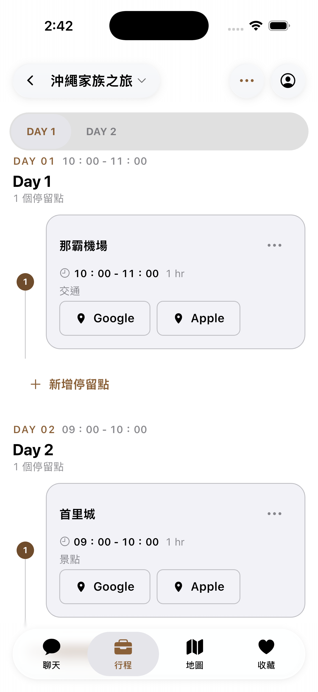
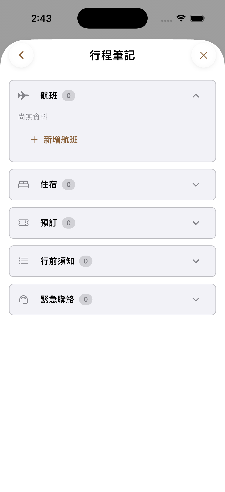

# #270 iOS 模擬器畫面證據

- 程式碼：`5f68e2bf96a37a634da5043387d0c7ea91ccecfe`
- 裝置：iPhone 17 Pro 模擬器、iOS 26.5
- 資料：`integration_test/support/app_flow_fixture.dart` 的假登入與行程；沒有連接正式帳號或正式 API。
- 驗證：模擬器整合流程 1 項通過；畫面以 `simctl io screenshot` 擷取並目視確認。

截圖驗證的是目前模擬器中的畫面與幾何。依使用者決議，#270 不要求真機驗收；模擬器也不作為材質折射或邊緣光的真機結論。
